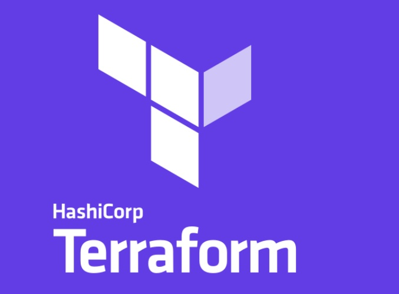

# Terraform
  

<h2> Pre-requisite </h2>

<h3> Install the terraform </h3>
<a href=https://developer.hashicorp.com/terraform/tutorials/aws-get-started/install-cli> <i> Installation link </i> </a>

<h3> Install AWS CLI </h3>
<a href=https://docs.aws.amazon.com/cli/latest/userguide/getting-started-install.html> <i> Installation link </i> </a>
